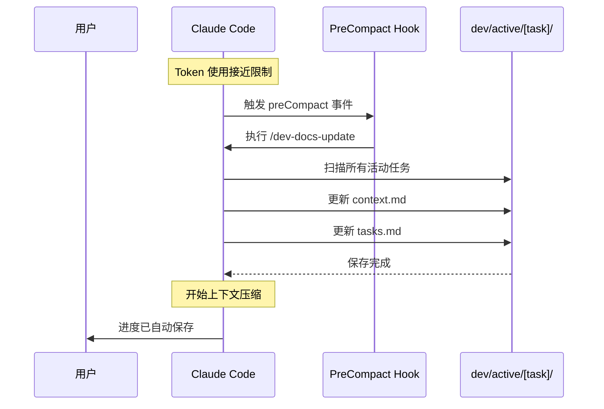

# Hooks 配置指南

本项目推荐配置 Claude Code hooks 以实现自动化工作流。

---

## 推荐的 Hook 配置

### PreCompact Hook - 自动保存进度

**作用**：在上下文压缩前自动触发 `/dev-docs-update`，确保所有进度被保存。

---

## 配置方式

### 方式 1：项目级配置（推荐）

项目已包含 `.claude/hooks.json` 配置文件，Claude Code 会自动识别。

**配置内容**：
```json
{
  "hooks": {
    "preCompact": {
      "enabled": true,
      "command": "/dev-docs-update",
      "description": "在上下文压缩前自动保存 Dev Docs 进度"
    }
  }
}
```

### 方式 2：用户级配置（全局生效）

如果希望在所有项目中启用，可在 Claude Code 用户设置中配置：

**步骤**：
1. 打开 Claude Code 设置
2. 找到 `hooks` 配置项
3. 添加以下配置：

```json
{
  "hooks": {
    "preCompact": "/dev-docs-update"
  }
}
```

---

## 工作原理



---

## 触发时机

### PreCompact Hook 触发条件
- ✅ Token 使用接近上限（通常 ~180K/200K）
- ✅ Claude 准备压缩上下文时
- ✅ 自动触发，无需手动操作

### 执行内容
1. 扫描 `dev/active/` 下的所有任务
2. 更新每个任务的 `context.md`：
   - 当前实现状态
   - 本次会话的关键决策
   - 下一步骤
3. 更新每个任务的 `tasks.md`：
   - 标记已完成任务 ✅
   - 添加新发现的任务
   - 更新进度状态
4. 添加交接笔记

---

## 其他可用的 Hooks

### PostToolCall Hook
在每次工具调用后触发（如文件读写、命令执行）

**用例**：
```json
{
  "hooks": {
    "postToolCall": {
      "enabled": true,
      "command": "echo 'Tool executed'",
      "description": "工具调用后的通知"
    }
  }
}
```

### UserPromptSubmit Hook
在用户提交 prompt 后触发

**用例**：
```json
{
  "hooks": {
    "userPromptSubmit": {
      "enabled": true,
      "command": "/request-analyzer",
      "description": "自动分析用户请求"
    }
  }
}
```

---

## 验证配置

### 检查 Hook 是否生效

**方式 1：查看日志**
Claude Code 会在触发 hook 时输出日志信息。

**方式 2：手动触发**
在接近 token 限制时观察是否自动执行 `/dev-docs-update`。

**方式 3：测试命令**
手动运行 `/dev-docs-update` 确认命令可用。

---

## 最佳实践

### 1. 配合 Dev Docs 使用
PreCompact hook 专为 Dev Docs Pattern 设计，确保：
- ✅ 至少有一个活动任务在 `dev/active/`
- ✅ 任务包含完整的三文件结构
- ✅ `context.md` 中有 SESSION PROGRESS 部分

### 2. 不要禁用 Hook
除非你有特殊需求，否则保持 PreCompact hook 启用：
- ❌ 禁用 = 上下文压缩时进度丢失
- ✅ 启用 = 自动保存，无忧工作

### 3. 定期检查保存结果
偶尔打开 `dev/active/[task]/context.md` 确认：
- SESSION PROGRESS 是否更新
- 最后更新时间是否正确
- 进度记录是否完整

---

## 故障排除

### Hook 未触发

**可能原因**：
1. `hooks.json` 格式错误
2. `.claude/commands/dev-docs-update.md` 不存在
3. `dev/active/` 目录为空

**解决方案**：
```bash
# 检查配置文件格式
cat .claude/hooks.json

# 检查命令文件存在
ls .claude/commands/dev-docs-update.md

# 检查活动任务
ls dev/active/
```

### Hook 执行失败

**可能原因**：
1. `/dev-docs-update` 命令有误
2. 无写入权限

**解决方案**：
- 手动运行 `/dev-docs-update` 查看错误信息
- 检查 `dev/active/` 目录权限

---

## 收益

### 自动化 vs 手动

| 对比项 | 手动保存 | 自动保存（Hook） |
|--------|---------|------------------|
| **触发方式** | 记得运行 `/dev-docs-update` | 自动触发 |
| **触发时机** | 可能忘记 | 每次压缩前 |
| **进度丢失风险** | 高 | 极低 |
| **心智负担** | 需要记住 | 零负担 |
| **可靠性** | 依赖人工 | 系统保证 |

### 实际效果

**场景**：长时间开发会话（4-6 小时）

**无 Hook**：
```
会话开始 → 工作 2 小时 → 忘记保存 → Token 满
→ 上下文压缩 → 进度丢失 → 重新理解（30 分钟）
```

**有 Hook**：
```
会话开始 → 工作 2 小时 → Token 满
→ Hook 自动保存 → 上下文压缩 → 5 秒恢复 → 继续工作
```

**节省时间**：30 分钟/次压缩

---

## 下一步

1. ✅ 确认 `.claude/hooks.json` 存在
2. ✅ 重启 Claude Code（如需要）
3. ✅ 创建第一个 Dev Docs 任务测试
4. ✅ 等待自动保存触发

**配置完成后，你将拥有完全自动化的上下文保护机制！**
